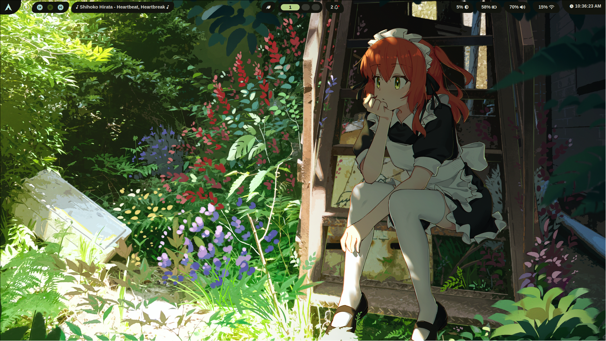

This is not intended for use lmao, I did a lot of things in super roundabout ways and generally was just having fun with this, but hey, if it works it works.

  
Showcase!

  
  
  
  
  
  
  
  
  

## System Info
- **Distro:** EndeavourOS
- **WM:** Hyprland
- **Terminal:** Kitty
- **Shell:** Bash

## Stuff
- **Cava** - Music visualizer
- **Fastfetch** - System info in terminal
- **Matugen** - Wallpaper color sync
- **Rofi** - App launcher
- **SwayNC** - Notification center
- **Waybar** - Status bar for Hyprland
- **Waypaper** - Wallpaper manager
- **wlogout** - Logout/shutdown menu

this was mostly done for fun, you can't use these files most likely since they might rely on other stuff that I didn't put into the repo, like some symlinks to fix issues with things not finding the path to their configs (probably my fault).
But yeah this is it, 5 days of ricing, learnt a lot, crashed out multiple times, but it was fun.
